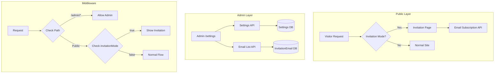

# Design Document: Invitation Mode

## Overview

Davet Modu, site yayına alınmadan önce ziyaretçileri karşılayan özel bir landing page sistemidir. Bu özellik, admin panelinden tek bir toggle ile aktif edilebilir ve aktif olduğunda tüm public sayfalar yerine etkileyici bir davet sayfası gösterilir. Ziyaretçiler e-posta bırakarak site lansmanından haberdar olabilir.

### Key Features
- Admin ayarlarında davet modu toggle'ı
- Tam ekran, animasyonlu davet sayfası
- Geri sayım sayacı (opsiyonel lansman tarihi)
- E-posta toplama formu
- Sosyal medya linkleri
- Admin paneli erişimi korunur (sadece direkt URL ile)

## Architecture



## Components and Interfaces

### 1. Database Schema Extensions

```prisma
// Settings model extension
model Settings {
  // ... existing fields
  invitationMode          Boolean   @default(false)
  invitationHeadline      String?
  invitationDescription   String?
  invitationLaunchDate    DateTime?
  invitationBackgroundImage String?
  invitationTwitterUrl    String?
  invitationInstagramUrl  String?
  invitationFacebookUrl   String?
}

// New model for email collection
model InvitationEmail {
  id          String   @id @default(auto()) @map("_id") @db.ObjectId
  email       String   @unique
  subscribedAt DateTime @default(now())
  
  @@map("invitation_emails")
}
```

### 2. API Endpoints

#### Settings API Extension (PUT /api/settings)
```typescript
interface InvitationSettings {
  invitationMode: boolean;
  invitationHeadline?: string;
  invitationDescription?: string;
  invitationLaunchDate?: Date;
  invitationBackgroundImage?: string;
  invitationTwitterUrl?: string;
  invitationInstagramUrl?: string;
  invitationFacebookUrl?: string;
}
```

#### Email Subscription API (POST /api/invitation/subscribe)
```typescript
// Request
interface SubscribeRequest {
  email: string;
}

// Response
interface SubscribeResponse {
  success: boolean;
  message: string;
  alreadySubscribed?: boolean;
}
```

#### Email List API (GET /api/invitation/emails)
```typescript
// Response
interface EmailListResponse {
  data: Array<{
    id: string;
    email: string;
    subscribedAt: Date;
  }>;
  count: number;
}
```

#### Email Export API (GET /api/invitation/emails/export)
Returns CSV file with Content-Type: text/csv

#### Email Delete API (DELETE /api/invitation/emails/:id)
```typescript
interface DeleteResponse {
  success: boolean;
}
```

### 3. React Components

#### InvitationPage Component
```typescript
interface InvitationPageProps {
  settings: {
    siteTitle: string;
    invitationHeadline?: string;
    invitationDescription?: string;
    invitationLaunchDate?: Date;
    invitationBackgroundImage?: string;
    invitationTwitterUrl?: string;
    invitationInstagramUrl?: string;
    invitationFacebookUrl?: string;
  };
}
```

#### InvitationCountdown Component
```typescript
interface CountdownProps {
  targetDate: Date;
}
```

#### EmailSubscriptionForm Component
```typescript
interface EmailFormProps {
  onSuccess?: () => void;
}
```

#### InvitationSettingsForm Component (Admin)
```typescript
interface InvitationSettingsProps {
  settings: InvitationSettings;
  emailCount: number;
  onSave: (settings: InvitationSettings) => Promise<void>;
}
```

## Data Models

### Settings Model (Extended)
| Field | Type | Description |
|-------|------|-------------|
| invitationMode | Boolean | Davet modunun aktif olup olmadığı |
| invitationHeadline | String? | Ana başlık metni |
| invitationDescription | String? | Alt açıklama metni |
| invitationLaunchDate | DateTime? | Geri sayım için hedef tarih |
| invitationBackgroundImage | String? | Arka plan görseli URL'i |
| invitationTwitterUrl | String? | Twitter profil linki |
| invitationInstagramUrl | String? | Instagram profil linki |
| invitationFacebookUrl | String? | Facebook sayfa linki |

### InvitationEmail Model
| Field | Type | Description |
|-------|------|-------------|
| id | ObjectId | Unique identifier |
| email | String | Abone e-posta adresi (unique) |
| subscribedAt | DateTime | Abonelik tarihi |

## Correctness Properties

*A property is a characteristic or behavior that should hold true across all valid executions of a system-essentially, a formal statement about what the system should do. Properties serve as the bridge between human-readable specifications and machine-verifiable correctness guarantees.*

### Property 1: Settings Persistence Round-Trip
*For any* valid invitation settings object, saving it to the database and then retrieving it should produce an equivalent settings object with all invitation-related fields preserved.
**Validates: Requirements 1.1, 1.3**

### Property 2: Invalid Settings Rejection
*For any* settings object with invalid field values (e.g., invalid URL format, invalid date), the system should reject the save operation and return a validation error.
**Validates: Requirements 1.4**

### Property 3: Invitation Mode Routing
*For any* public route request, when invitationMode is true in settings, the response should contain the invitation page content and not the normal page content.
**Validates: Requirements 2.1**

### Property 4: Valid Email Subscription
*For any* valid email address format, submitting it to the subscription endpoint should result in that email being stored in the InvitationEmail collection.
**Validates: Requirements 3.1**

### Property 5: Invalid Email Rejection
*For any* string that does not match a valid email format, submitting it to the subscription endpoint should return a validation error and not store anything in the database.
**Validates: Requirements 3.3**

### Property 6: CSV Export Completeness
*For any* set of emails in the InvitationEmail collection, the exported CSV should contain exactly all those emails with their subscription dates.
**Validates: Requirements 5.3**

### Property 7: Admin Access During Invitation Mode
*For any* authenticated admin user, when invitationMode is true, all admin panel routes (/admin/*) should remain accessible and functional.
**Validates: Requirements 6.1**

## Error Handling

### API Error Responses
```typescript
interface APIError {
  error: string;
  code: 'VALIDATION_ERROR' | 'DUPLICATE_EMAIL' | 'UNAUTHORIZED' | 'SERVER_ERROR';
  details?: Record<string, string>;
}
```

### Error Scenarios
| Scenario | HTTP Status | Error Code | User Message |
|----------|-------------|------------|--------------|
| Invalid email format | 400 | VALIDATION_ERROR | "Geçerli bir e-posta adresi girin" |
| Duplicate email | 409 | DUPLICATE_EMAIL | "Bu e-posta adresi zaten kayıtlı" |
| Invalid URL format | 400 | VALIDATION_ERROR | "Geçerli bir URL girin" |
| Unauthorized access | 401 | UNAUTHORIZED | "Bu işlem için yetkiniz yok" |
| Server error | 500 | SERVER_ERROR | "Bir hata oluştu, lütfen tekrar deneyin" |

### Validation Rules
- Email: RFC 5322 compliant email format
- URLs: Valid HTTP/HTTPS URL format
- Launch Date: Must be a future date when set
- Headline: Max 200 characters
- Description: Max 1000 characters

## Testing Strategy

### Unit Testing
- Use Vitest for unit tests
- Test validation functions for email and URL formats
- Test countdown calculation logic
- Test CSV generation function

### Property-Based Testing
- Use fast-check library for property-based tests
- Configure minimum 100 iterations per property test
- Tag each property test with: `**Feature: invitation-mode, Property {number}: {property_text}**`

### Test Coverage Requirements
- All API endpoints must have integration tests
- All validation logic must have property-based tests
- UI components should have basic render tests

### Test File Structure
```
tests/
├── lib/
│   └── invitation-mode.test.ts      # Property tests for core logic
├── api/
│   └── invitation.test.ts           # API endpoint tests
└── components/
    └── InvitationPage.test.tsx      # Component tests
```
